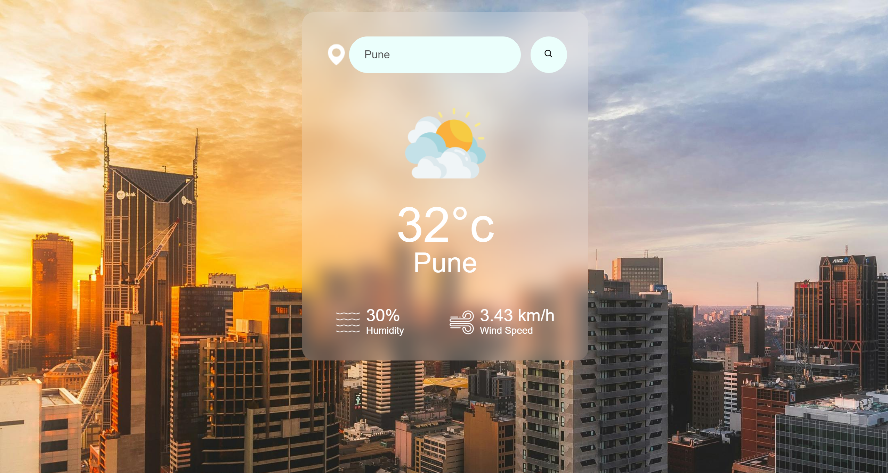

# SkyCast - Weather Web Application

## Overview
This is a simple weather web application that allows users to check the current weather conditions of any location worldwide. It's built using HTML, CSS, and JavaScript, and it utilizes the OpenWeatherMap API to fetch weather data.

## Features
- **Current Weather**: Users can enter the name of a city or a zip code to get the current weather conditions, including temperature, humidity, wind speed, and weather description.
- **Responsive Design**: The application is designed to be responsive and can be viewed on various devices, including desktops, tablets, and smartphones.
- **User-friendly Interface**: The interface is intuitive and straightforward, making it easy for users to interact with the application and obtain weather information quickly.

## Installation
1. Clone the repository or download the source code.
   ```bash
   git clone <repository-url>
   ```
2. Obtain an API key from OpenWeatherMap by signing up at [OpenWeatherMap API](https://openweathermap.org/api) and replace `<YOUR_API_KEY>` in the `script.js` file with your API key.
3. Open the `index.html` file in a web browser.

## Usage
1. Enter the name of a city or a zip code in the input field.
2. Press the "Search" button or hit Enter to fetch the weather data.
3. The weather information for the entered location will be displayed below the input field.

## Technologies Used
- HTML
- CSS
- JavaScript
- OpenWeatherMap API

## Preview


## Credits
- Weather data provided by [OpenWeatherMap](https://openweathermap.org/)
- Icons from [Flaticon](https://www.flaticon.com/)
